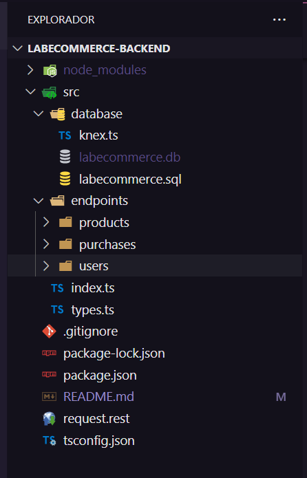
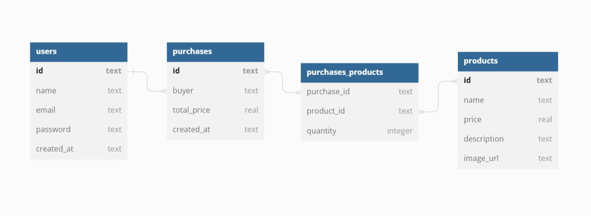

# Labecommerce

### O projeto Labecommerce consiste em uma API onde simulamos as rotinas de trabalho de um e-commerce. Este projeto foi proposto pelo curso  de Desenvolvimento Web Full Stack da Labenu, onde aplicamos a base de criação de uma API vinculada a um banco de dados.
<hr><br>

## 📋 Índice:
<hr>

- <a href="#layout">Layout</a>
- <a href="#requisicoes">Requisições</a>
- <a href="#exemplos">Exemplos de Requisições</a>
- <a href="#documentacao-post">Documentação no Postman</a>
- <a href="#tecnologias">Tecnologias Utilizadas</a>
- <a href="#como-rodar">Como Rodar o Projeto</a>
- <a href="#pessoas-autoras">Pessoas Autoras</a>

<br>

<span id="layout"></span>

## 1. 📐 Layout
<hr>

### 1.1 Estrutura das Pastas
<br>


<br>

##  1.2 Estrutura Tabelas

<br>


<br>

## 1.3 Endpoints Implementados
<br>

- [x] Get All Users
- [x] Create User
- [x] Delete User By Id
- [x] Create Product
- [x] Get All Products
- [x] Get Product By Id
- [x] Update Product By Id
- [x] Delete Product By Id
- [x] Create Purchase
- [x] Get Purchase By Id
- [x] Delete Purchase By Id
<br>

<span id="requisicoes"></span>

## 2. 📲 Requisições
<hr>

### 2.1 - Requisições de Usuários
- /users 

### 2.2 - Requisições de Produtos
- /products

### 2.3 - Requisições de Compras
- /purchases

<br>
<span id="exemplos"></span>

## 3. Exemplos de Requisições
<hr>
<br>

### 3.1 - Requisições de Usuários

* `GET /users`: Retorna os usuários cadastrados.

```json
[
    {
        "id": "u001",
        "name": "Manoel da Silva",
        "email": "manuel@gmail",
        "password": "neneu123",
        "createdAt": "2023-07-08 15:26:33"
    },
    {
        "id": "u002",
        "name": "Maria Zefinha da Silva",
        "email": "zefa@gmail",
        "password": "zeze123",
        "createdAt": "2023-07-08 15:30:22"
    },
    {
        "id": "u003",
        "name": "Tenório José Carlos",
        "email": "zeca@gmail",
        "password": "zeca123",
        "createdAt": "2023-07-12 14:51:28"
    }
]
```
* `POST /users`: Cadastra um novo usuário.
```json
{
    "message": "Registered user!"
}
```

* `DELETE /users/:id`: Deleta um usuário cadastrado.
```json
{
    "message": "deleted user"
}
```
<br>

### 3.2 - Requisições de Produtos

* `GET /products`: Retorna todos os produtos cadastrados.
```json
[
    {
        "id": "prod002",
        "name": "Mouse Gamer 002",
        "price": 899.99,
        "description": "The best Mouse Gamer 002",
        "imageUrl": "https://images.pexels.com/photos/1644557/pexels-photo-1644557.jpeg?auto=compress&cs=tinysrgb&w=1260&h=750&dpr=1"
    },
    {
        "id": "prod003",
        "name": "Teclado Gamer 003",
        "price": 982.99,
        "description": "The best Teclado Gamer 003",
        "imageUrl": "https://images.pexels.com/photos/1644557/pexels-photo-1644557.jpeg?auto=compress&cs=tinysrgb&w=1260&h=750&dpr=1"
    },
    {
        "id": "prod004",
        "name": "PC Gamer 004",
        "price": 10799.99,
        "description": "The best PC Gamer 004",
        "imageUrl": "https://images.pexels.com/photos/1038916/pexels-photo-1038916.jpeg?auto=compress&cs=tinysrgb&w=1260&h=750&dpr=1"
    }
]
```

* `GET /products/:id`: Retorna o produto com o Id informado.
```json
{
    "id": "prod002",
    "name": "Mouse Gamer 002",
    "price": 899.99,
    "description": "The best Mouse Gamer 002",
    "image_url": "https://images.pexels.com/photos/1644557/pexels-photo-1644557.jpeg?auto=compress&cs=tinysrgb&w=1260&h=750&dpr=1"
}
```

* `POST /products`: Cadastra um novo produto.
```json
{
    "message": "Registered Product!"
}
```

* `UPDATE /products/:id`: Altera dados do produto pelo Id.
```json
{
    "message": "Update product"
}
```

* `DELETE /products/:id`: Deleta o produto pelo Id.
```json
{
    "message": "deleted product"
}
```
<br>

### 3.3 - Requisições de Compras

* `GET /purchases/:id`: Retorna dados da compra do Id informado.
```json
{
    "purchaseId": "pur001",
    "buyerId": "u001",
    "buyerName": "Manoel da Silva",
    "buyerEmail": "manuel@gmail",
    "totalPrice": 70000,
    "createdAt": "2023-07-10 15:04:00",
    "products": [
        {
            "id": "prod001",
            "name": "Monitor update top 001",
            "price": 2959.98,
            "description": "The best Monitor update top 001",
            "imageUrl": "https://images.pexels.com/photos/1029757/pexels-photo-1029757.jpeg?auto=compress&cs=tinysrgb&w=600",
            "quantity": 1
        }
    ]
}
```

* `POST /purchases`: Registra uma nova compra.
```json
{
    "message": "registered purchase"
}
```

* `DELETE /purchases/:id`: Deleta o registro da compra.
```json
{
    "message": "successfully canceled purchase"
}
```
<br>
<span id="documentacao-post"></span>

## 4. 💾 Documentação do Postman
<hr>
link: https://documenter.getpostman.com/view/26594531/2s946chEgy

<br><br>
<span id="tecnologias"></span>

## 5. 🛠 Tecnologias Utilizadas
<hr>

- [Node.js](https://nodejs.org/en/)
- [TypeScript](https://www.typescriptlang.org/)
- [Express](https://expressjs.com/pt-br/)
- [SQL](https://learn.microsoft.com/pt-br/sql/?view=sql-server-ver16)
- [SQLite](https://www.sqlite.org/docs.html)
- [Knex.js](https://knexjs.org/guide/)

<br>
<span id="como-rodar"></span>

## 6. 🎥 Como Rodar o Projeto
<hr>

### 6.1 - Ferramentas Necessárias
<p>Para poder rodar esse projeto na sua máquina, você precisa ter as seguintes ferramentas instaladas:</p>

- [Git](https://git-scm.com)
- [Node.js](https://nodejs.org/en/)
<br>

### 6.2 - Clonando Repositório
```bash
# Clone este repositório
$ git clone <https://github.com/ffernanda85/labecommerce-backend.git>
```
### 6.3 - Instalando as Dependências
```bash
# Instale as dependências
$ npm install
```

### 6.4 - Executando a Aplicação
```bash
$ npm run dev

# O servidor iniciará na porta: 3003, você poderá acessar a aplicação em: <http://localhost:3003>
```
<br>
<span id="pessoas-autoras"></span>

## 👩🏽‍💻Pessoas Autoras:
<hr><br>


<br/>

<h4>Flávia Santos</h4>
<br/>

Linkedin: https://www.linkedin.com/in/flavia-santos-dev/